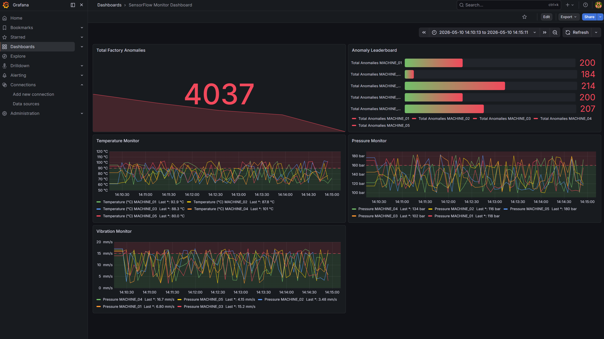
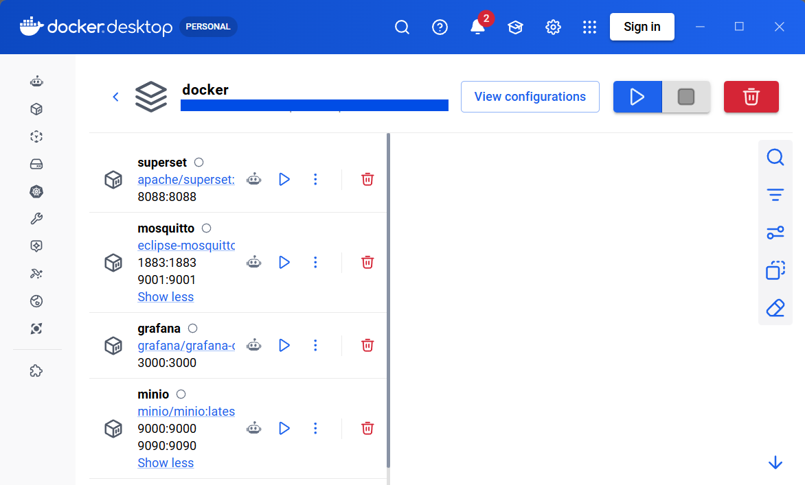

# sensorflow-local


A fully local simulation of an AWS IoT Data Warehouse pipeline. Five factory machines publish sensor readings over MQTT; the data flows through a Bronze → Silver → Gold medallion architecture, lands in DuckDB, and surfaces in Grafana and Superset dashboards — all on your laptop, no AWS account required.




---

## Architecture

```
sensor_simulator.py          stream_consumer.py
5 machines × 4 sensors  →   MQTT subscribe → 60 s batch → MinIO raw/  (BRONZE)
         │                                                       │
         |                                                       |
         └── cdc_handler.py (anomalies → DuckDB anomaly_log)     │
                                                          glue_etl_local.py
                                                     MinIO raw/ → processed/  (SILVER)
                                                                 │
                                                                 |
                                                            gold_writer.py
                                                       DuckDB star schema  (GOLD)
                                                                 │
                                                                 |
                                              ┌──────────────────┴───────────────────┐
                                        nightly_job.py                    export_for_grafana.py
                                   hourly_machine_summary              data/grafana/*.json
                                              │                                  │
                                        Superset :8088                    Grafana :3000
```


**Local ↔ AWS equivalents**


| Local | AWS |
|---|---|
| Mosquitto (MQTT :1883) | AWS IoT Core |
| `stream_consumer.py` | Kinesis + Firehose |
| MinIO (:9000) | Amazon S3 |
| `glue_etl_local.py` (PySpark) | AWS Glue 4.0 |
| DuckDB (`data/sensorflow.db`) | Athena / Iceberg |
| `cdc_handler.py` | Lambda + Kinesis |
| `nightly_job.py` | Glue + EventBridge |
| Grafana OSS (:3000) | Amazon Managed Grafana |
| Apache Superset (:8088) | Amazon QuickSight |


---


## Prerequisites

- Python 3.10+
- Docker Desktop (running)
- Java 11+ (required by PySpark)
- AWS CLI v2 (used only locally for MinIO)


---


## Quick Start


```powershell
# 1. Create and activate virtual environment
python -m venv .venv
.venv\Scripts\activate


# 2. Install dependencies
pip install -r requirements.txt


# 3. Start Docker infrastructure (Mosquitto, MinIO, Grafana, Superset)
docker compose -f docker/docker-compose.yml up -d


# 4. Configure environment (edit values after creating)
copy .env.example .env


# 5. Run the full pipeline continuously
python run.py
```


`run.py` starts all ingestion processes in parallel, runs the batch pipeline on a schedule, auto-restarts crashed processes, and shuts everything down cleanly on Ctrl+C.





---


## Project Structure


```
sensorflow-local/
├── run.py                               ← continuous pipeline orchestrator (Phase 06)
├── src/
│   ├── __init__.py
│   ├── simulator/
│   │   ├── __init__.py
│   │   └── sensor_simulator.py          ← generates factory sensor readings, publishes to Mosquitto over MQTT (Phase 01)
│   ├── ingestion/
│   │   ├── __init__.py
│   │   └── stream_consumer.py           ← subscribes to MQTT topic, flushes JSON to MinIO raw/ (Phase 01)
│   ├── etl/
│   │   ├── __init__.py
│   │   ├── glue_etl_local.py            ← PySpark Bronze→Silver ETL (Phase 02)
│   │   └── jars/
│   │       ├── hadoop-aws-3.3.4.jar
│   │       └── aws-java-sdk-bundle-1.12.367.jar
│   ├── gold/
│   │   ├── __init__.py
│   │   └── gold_writer.py               ← DuckDB star schema loader (Phase 03)
│   ├── cdc/
│   │   ├── __init__.py
│   │   └── cdc_handler.py               ← real-time anomaly capture (Phase 05)
│   ├── aggregation/
│   │   ├── __init__.py
│   │   └── nightly_job.py               ← hourly rollup aggregation (Phase 05)
│   ├── analytics/
│   │   ├── __init__.py
│   │   ├── analytics.py                 ← Plotly rolling-avg export (Phase 06)
│   │   └── export_for_grafana.py        ← DuckDB → JSON for Grafana (Phase 06)
│   └── security/
│       ├── __init__.py
│       └── duckdb_roles.py              ← IAM role simulation (Phase 04)
├── docker/
│   ├── mosquitto/
│   │   └── mosquitto.conf
│   └── docker-compose.yml
├── queries/
│   ├── BQ-01.sql                        ← hot machines (MAX temp)
│   ├── BQ-02.sql                        ← machine uptime %
│   ├── BQ-03.sql                        ← shift anomaly rate
│   └── BQ-04.sql                        ← 7-day rolling avg temp
├── tests/
├── data/
│   ├── sensorflow.db                    ← DuckDB Gold layer database
│   ├── dlq.jsonl                        ← CDC dead-letter queue (parse errors)
│   └── grafana/                         ← JSON files served to Grafana
├── logs/
│   ├── pipeline.log                     ← batch cycle events, row counts, restarts
│   ├── simulator.log
│   ├── consumer.log
│   ├── cdc_handler.log
│   └── nightly_job.log
├── .env                                 ← MinIO + MQTT config (never commit)
├── .gitignore
├── requirements.txt
└── .venv/
```


---


## Phases


| Phase | What it builds | Key scripts |
|---|---|---|
| 00 — Environment | Docker stack: Mosquitto, MinIO, Grafana, Superset | `docker-compose.yml` |
| 01 — Simulator & Consumer | Bronze layer — MQTT publish/subscribe, MinIO ingest | `sensor_simulator.py`, `stream_consumer.py` |
| 02 — PySpark ETL | Silver layer — type-cast, dedup, anomaly flag, shift derive | `glue_etl_local.py` |
| 03 — Gold Layer | DuckDB star schema + 4 business queries | `gold_writer.py`, `BQ-01..04.sql` |
| 04 — Security | IAM role simulation (engineer / analyst / viewer) | `duckdb_roles.py` |
| 05 — CDC & Nightly | Real-time anomaly capture + hourly aggregations | `cdc_handler.py`, `nightly_job.py` |
| 06 — Dashboards | Grafana + Superset charts, Plotly export, full pipeline orchestration | `export_for_grafana.py`, `analytics.py`, `run.py` |


---


## Configuration


Create `.env` in the project root (copy from `.env.example` or create manually):


```env
# MinIO (S3-compatible)
AWS_ACCESS_KEY_ID=minioadmin
AWS_SECRET_ACCESS_KEY=minioadmin
AWS_ENDPOINT_URL=http://localhost:9000
AWS_DEFAULT_REGION=us-east-1


# MQTT
MQTT_BROKER=localhost
MQTT_PORT=1883
MQTT_TOPIC=sensors/data


# Simulator
SIM_MODE=NORMAL          # NORMAL or anomaly
SIM_INTERVAL=5           # seconds between publishes
```


---


## run.py — Continuous Pipeline


`run.py` is the single command that orchestrates the whole pipeline:


```
python run.py                        # normal mode, batch every 5 min
python run.py --mode anomaly         # ~5% anomaly injection
python run.py --batch-interval 120   # batch every 2 min
python run.py --warmup 30            # first batch after 30 s
python run.py --skip-etl             # skip PySpark step
python run.py --once                 # one batch then exit (CI / testing)
```


**Two-tier design:**


- **Ingestion tier** (always-on, parallel): `consumer` → `cdc_handler` → `simulator`. Crashed processes restart with exponential backoff (5 s, 10 s, 20 s … max 5 retries).
- **Batch tier** (scheduled): PySpark ETL → `gold_writer` → `nightly_job` → `grafana_export` → Superset DB sync → row-count summary. Skipped silently if MinIO has no raw data yet.


### Monitor


```powershell
# In a second terminal:
Get-Content logs\pipeline.log -Wait


# Per-process output:
Get-Content logs\simulator.log   -Wait
Get-Content logs\consumer.log    -Wait
Get-Content logs\cdc_handler.log -Wait
```


---


## Business Queries


| Query | Question |
|---|---|
| BQ-01 | Which machines run hottest? (MAX temperature per machine) |
| BQ-02 | Machine uptime % (readings without anomaly / total readings) |
| BQ-03 | Anomaly rate by shift (day / evening / night) |
| BQ-04 | 7-day rolling average temperature per machine |


---


## Dashboards


| Dashboard | URL | Connection |
|---|---|---|
| Grafana | http://localhost:3000 | Infinity plugin → `data/grafana/*.json` (served on :8765) |
| Superset | http://localhost:8088 | `duckdb-engine` SQLAlchemy → `data/sensorflow.db` |
| MinIO console | http://localhost:9001 | `minioadmin` / `minioadmin` |


---


## Troubleshooting


| Symptom | Where to look | What to check |
|---|---|---|
| Grafana panels empty | `logs/pipeline.log` | Did a batch complete? Look for `[batch/gold]` failure lines |
| `hourly_machine_summary` empty | `logs/nightly_job.log` | `WARNING No data for <date>` or traceback |
| `data/dlq.jsonl` growing | `logs/cdc_handler.log` | `WARNING` + traceback per DLQ write — lock conflict / bad JSON / missing field |
| Consumer or CDC stopped | `logs/pipeline.log` | Watchdog restart lines: `[consumer] died — restart 1/5 in 5s` |
| PySpark step fails | `logs/pipeline.log` | `[batch/etl]` failure + check Java version (`java -version`) and JAR paths |
| Docker containers not responding | terminal | `docker compose -f docker/docker-compose.yml ps` — restart with `docker compose ... up -d` |


---


## .gitignore essentials


```
.venv/
__pycache__/
*.pyc
data/sensorflow.db
data/dlq.jsonl
data/grafana/
.env
logs/
```


---


## License


Internal development reference — not for distribution.